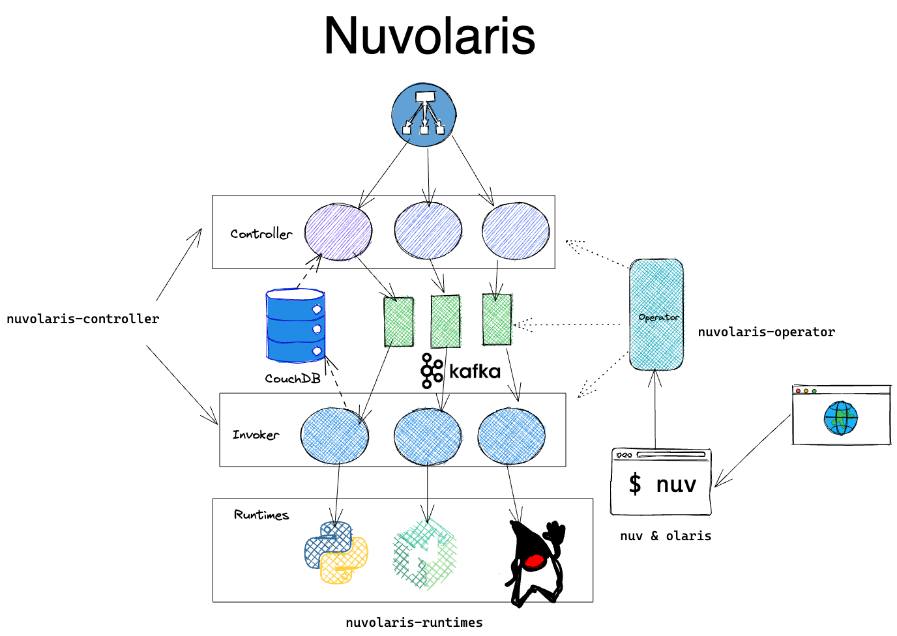

<!--
  ~ Licensed to the Apache Software Foundation (ASF) under one
  ~ or more contributor license agreements.  See the NOTICE file
  ~ distributed with this work for additional information
  ~ regarding copyright ownership.  The ASF licenses this file
  ~ to you under the Apache License, Version 2.0 (the
  ~ "License"); you may not use this file except in compliance
  ~ with the License.  You may obtain a copy of the License at
  ~
  ~   http://www.apache.org/licenses/LICENSE-2.0
  ~
  ~ Unless required by applicable law or agreed to in writing,
  ~ software distributed under the License is distributed on an
  ~ "AS IS" BASIS, WITHOUT WARRANTIES OR CONDITIONS OF ANY
  ~ KIND, either express or implied.  See the License for the
  ~ specific language governing permissions and limitations
  ~ under the License.
  ~
-->
# Index

- [Overview](#overview)
- Repo [`nuvolaris`](#nuvolaris)
- Repo [`nuvolaris-operator`](#nuvolaris-operator)
- Repo [`nuv`](#nuv)
- Repo [`olaris`](#olaris)
- Repo [`nuvolaris-documentation`](#nuvolaris-documentation)
- Repo [`nuvolaris-controller`](#nuvolaris-controller)
- Repo [`nuvolaris-runtimes`](#nuvolaris-runtimes)

## Overview

In this diagrama there is an overview of the repos in the Nuvolaris organization:

The main repositories, those relevant for the project, are  pinned and named `nuvolaris-*`. Also there are the repositories `nuv` and `olaris` which are the engine and the tasks of the CLI.  All the other repositories, especially those starting with `openwhisk*` and `nimbella*` are forks of our upstream source code. 

If we to make changes to our fork, we try to limit changes to the absolute minimum. 

Our work is always placed in branches starting with `nuvolaris`, and then they are included as git modules in the main ones.  And we try, when possible, to contribute back our changes tp upstream.

Development procedures are described in the [DEVEL](./DEVEL.md) document.

[Up.](#index)

### [`nuvolaris`](https://github.com/nuvolaris/nuvolaris)

This repo is the starting point.

It contains:

- project management documentation (that you are reading right now)
- the build for the development environment container
- references to all the other repositories
- the [Discussion Forum](https://nuvolaris.discourse.group)
- the [Issue Tracker](https://github.com/nuvolaris/nuvolaris/issues) to manage the whole project.

To discuss the project in general, introduce yourself in the forum, make suggestions or ask questions, post in the [general]  category on forum or in the correct category.

[Up.](#index)

### [`nuvolaris-controller`](https://github.com/nuvolaris/nuvolaris-controller)

This repo builds the OpenWhisk controller that is the core of OpenWhisk and publishes the images in the GitHub docker registry.

It includes as a subrepo our fork of [apache/openwhisk](https://github.com/nuvolaris/openwhisk)

[Up.](#index)

### [`nuvolaris-runtimes`](https://github.com/nuvolaris/nuvolaris-runtimes)

This repo builds the OpenWhisk runtimes and publishes the images in the GitHub docker registry.

It includes as a subrepo our fork of some (but not all) `apache/openwhisk-runtime-*`

[Up.](#index)

### [`nuvolaris-operator`](https://github.com/nuvolaris/nuvolaris-operator)

This repo builds our operator and published the image in the GitHub docker registry.

### [`nuv`](https://github.com/nuvolaris/nuv)

This repo builds the installer for the CLI.

### [`olaris`](https://github.com/nuvolaris/olaris)

This repo contains the tasks used by the `nuv`CLI which are automatically downloaded by the CLI itself

[Up.](#index)

### [`nuvolaris-documentation`](https://github.com/nuvolaris/nuvolaris-documentation)

This repo includes the documentation that is automatically included in the public website under [documentaion](https://www.nuvolaris.io/documentation)

[Up.](#index)
